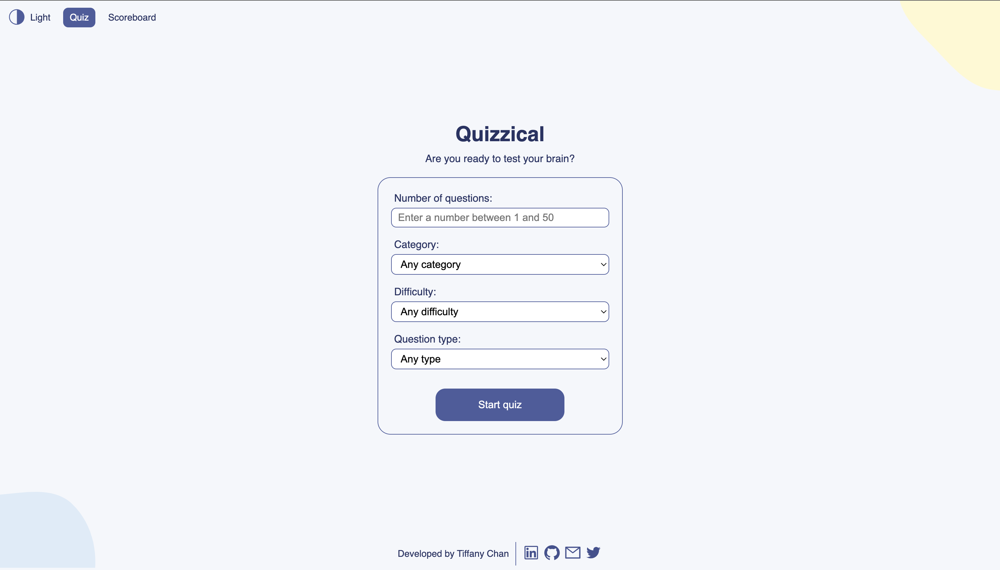
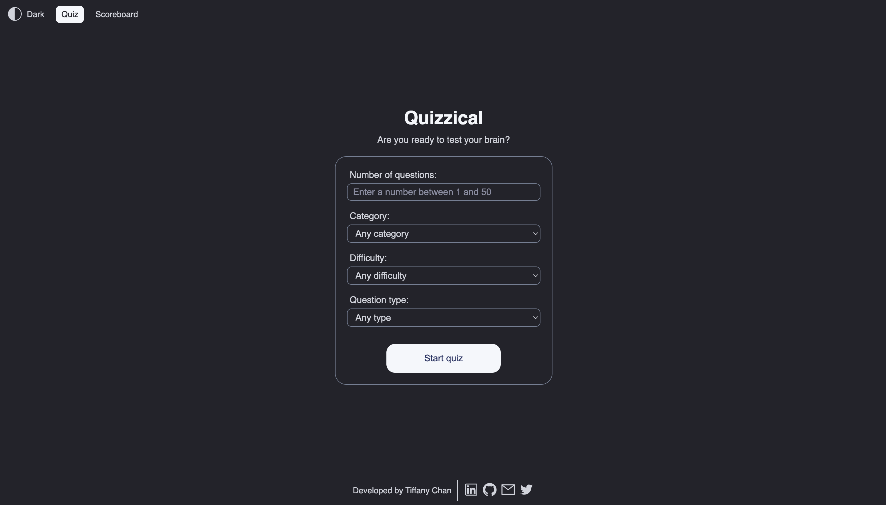
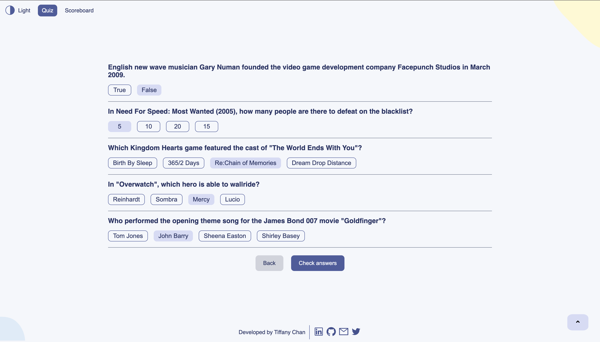
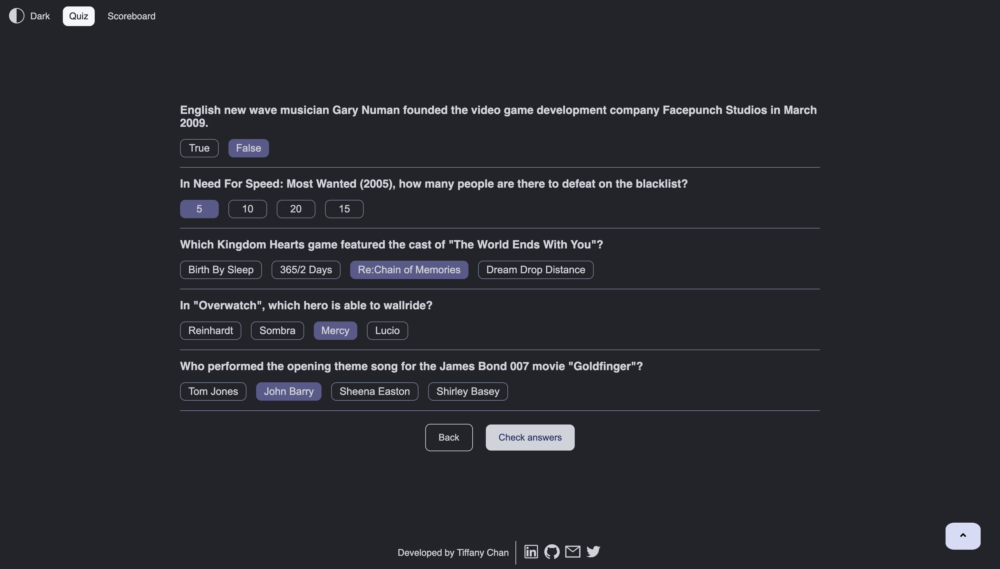
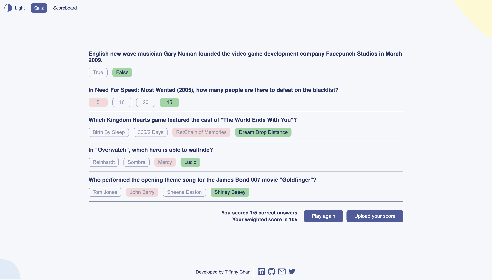
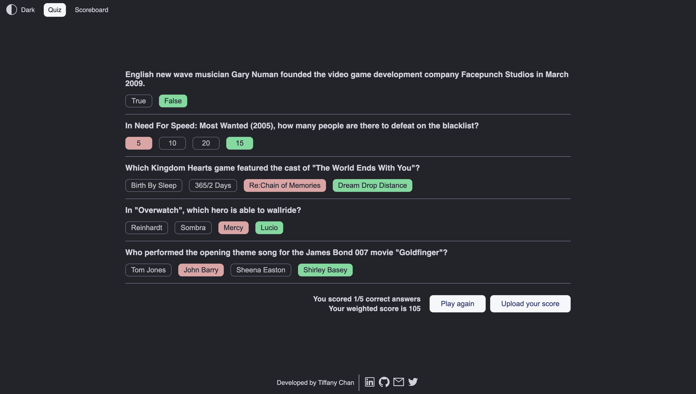
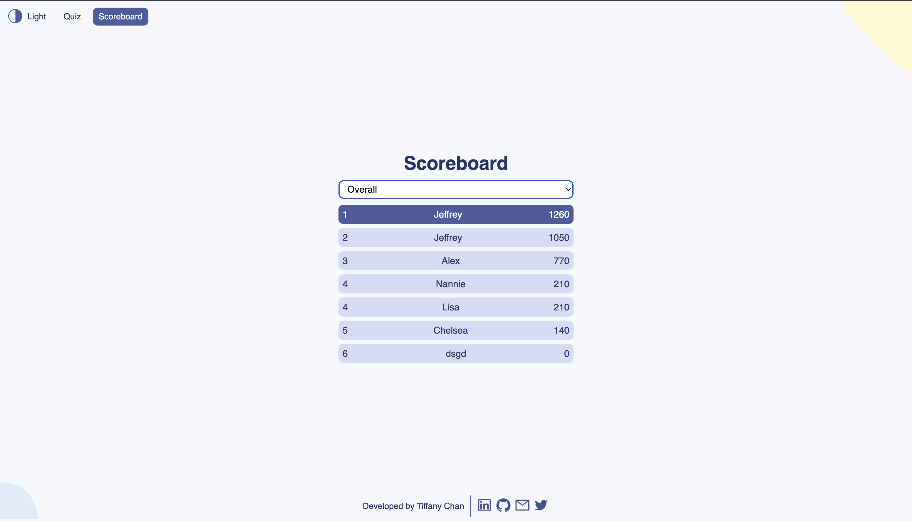
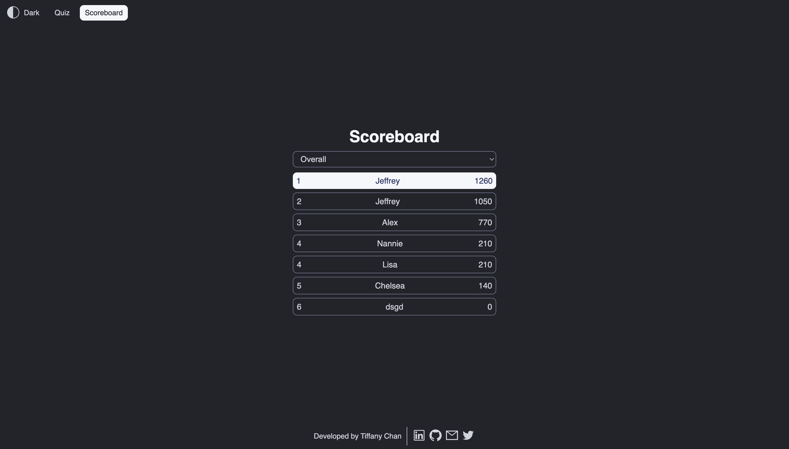

# React-Quizzical

## Table of Contents

- [Overview](#overview)
  - [Description](#description)
  - [Live Demo](#live-demo)
  - [Screenshots](#screenshots)
- [Getting Started](#getting-started)
  - [Built with](#built-with)
  - [Local Setup](#local-setup)
  - [Dependencies](#dependencies)
- [Features](#features)
  - [Project Requirements](#project-requirements)
  - [Extra Features](#extra-features)
- [Usage](#usage)
- [API](#api)
- [Skills Learned](#skills-learned)

## Overview

### Description

This is the final solo project of the [React course by Bob Ziroll on Scrimba](https://scrimba.com/learn/learnreact). The code is all written by me without any guidance. The project is a quiz app that fetches trivia questions from the [Open Trivia Database API](https://opentdb.com/) and score players based on their answers. I have extended the app to include features like allowing the user to configure the quiz, adding a leaderboard, and adding a dark mode.

### Screenshots









### Live Demo

You can try the page [here](https://quizzical987.netlify.app).

## Getting Started

### Built with

- HTML 5
- CSS 3
- JavaScript
- React JS
- Figma
- Firebase

### Run Locally

Clone the project

```bash
  git clone https://github.com/TiffanyChan614/React-Quizzical.git
```

Go to the project directory

```bash
  cd react-quizzical
```

Install dependencies

```bash
  npm install
```

Start the server

```bash
  npm run dev
```

### Dependencies

This project depends on the following packages:

- `classnames` (version ^2.3.2): A JavaScript utility for conditionally joining classNames together.
- `he` (version ^1.2.0): A robust HTML entity encoder/decoder.
- `react` (version ^18.2.0): A JavaScript library for building user interfaces.
- `react-dom` (version ^18.2.0): A package for working with the DOM in React applications.

This project also has the following development dependencies:

- `@types/react` (version ^18.0.37): TypeScript definitions for the React library.
- `@types/react-dom` (version ^18.0.11): TypeScript definitions for the react-dom package.
- `@vitejs/plugin-react` (version ^4.0.0): A Vite plugin for React development.
- `eslint` (version ^8.38.0): A tool for identifying and reporting on patterns found in ECMAScript/JavaScript code.
- `eslint-plugin-react` (version ^7.32.2): An ESLint plugin for React-specific linting rules.
- `eslint-plugin-react-hooks` (version ^4.6.0): An ESLint plugin for enforcing rules of Hooks in React applications.
- `eslint-plugin-react-refresh` (version ^0.3.4): An ESLint plugin for react-refresh.
- `vite` (version ^4.4.2): A frontend tooling platform that provides faster and leaner development for modern web projects.

## Features

### Project Requirements

- [x] Two screens: a start page and a quiz page
- [x] Pull 5 questions from the OTDB API
- [x] Tally correct answers after 'Check answers' is clicked
- [x] Styled and polished
- [x] Limit answer choice to 1 per question

### Extra Features

- [x] Allow the user to choose the number of questions they want to answer
- [x] Allow the user to choose the difficulty of the questions
- [x] Allow the user to choose the category of the questions
- [x] Allow the user to choose the category of the questions
- [x] Add a back button to the quiz page to allow the user to go back to the start page
- [x] Avoid shuffling the answers of true/false questions
- [x] Light/dark mode
- [x] Progress preserves when the user refreshes the page
- [x] Add a footer with links to my social media
- [x] Allow user to upload their score (caclulated based on the number of correct answers, questions answered, and difficulty) to a scoreboard
- [x] Add a scoreboard to display the top 25 scores
- [x] Responsive design
- [x] Highlight questions unanswered by the user in the quiz page
- [x] Button to scroll to the top of the page on the quiz page

## Usage

1. When you first load the application, you will see the start page with the title "Quizzical" and a prompt asking if you are ready to test your brain. Enter your configuration and click the "Start quiz" button to begin the quiz.
2. The application will fetch a set of trivia questions from the API and display them one by one on the quiz page.
3. For each question, choose the answer you think is correct by clicking on the corresponding button.
4. Once you have answered all the questions, click the "Check answers" button to see your score.
5. The answer page will display the questions again with the correct answers highlighted and your score out of the total number of questions.
6. To play again, click the "Play again" button.
7. To upload your score to the scoreboard, click the "Upload score" button and enter your name in the prompt.
8. To navigate between quiz and scoreboard, click the "Quiz" and "Scoreboard" buttons in the navigation bar.
9. To switch between light and dark mode, click theme logo in the navigation bar.

## API

- [Open Trivia Database API](https://opentdb.com/)

## Skills Learned

- Event handling in React
- Conditional rendering in React
- Fetching data from an API
- Handling state and side effects in React
- Using context and compound components in React
- Using custom hooks in React
- Storing and Retrieving data with queries from firebase

## License

[MIT](https://choosealicense.com/licenses/mit/)
