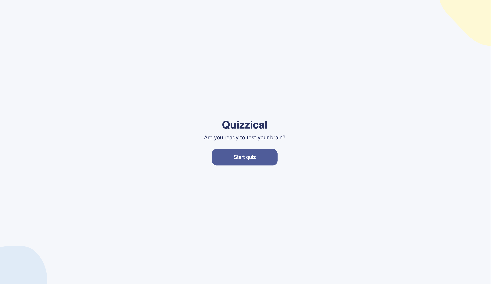
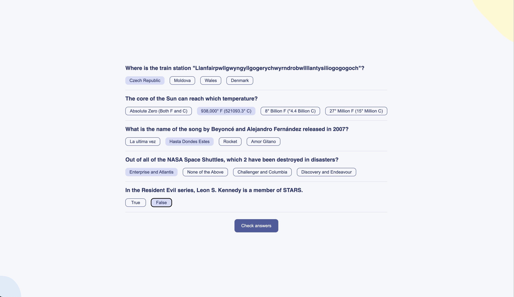
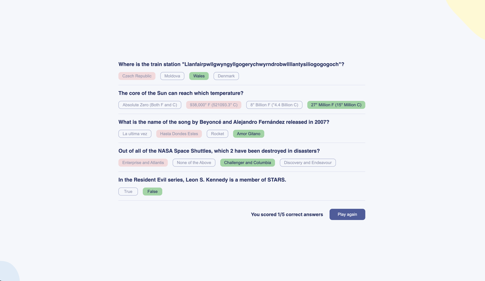

# React-Quizzical

## Description

This is the final solo project of the [React course by Bob Ziroll on Scrimba](https://scrimba.com/learn/learnreact). The code is all written by me without any guidance. The project is a quiz app that fetches trivia questions from the [Open Trivia Database API](https://opentdb.com/) and score players based on their answers.

## Live Demo

You can try the page [here](https://quizzical987.netlify.app).

## Built with

- HTML 5
- CSS 3
- JavaScript
- React JS

## Requirements

- Two screens: a start page and a quiz page (I make it three with an answer page. Reason for this see: [Why Three Page?](#why-three-pages))
- Pull 5 questions from the OTDB API
- Tally correct answers after 'Check answers' is clicked
- Styled and polished
- Limit answer choice to 1 per question

## Screenshots

## Usage

1. When you first load the application, you will see the start page with the title "Quizzical" and a prompt asking if you are ready to test your brain.
   Click the "Start quiz" button to begin the quiz.
2. The application will fetch a set of trivia questions from the API and display them one by one on the quiz page.
3. For each question, choose the answer you think is correct by clicking on the corresponding button.
4. Once you have answered all the questions, click the "Check answers" button to see your score.
5. The answer page will display the questions again with the correct answers highlighted and your score out of 5.
6. To play again, click the "Play again" button.

## Skills Learned

- Event handling in React
- Conditional rendering in React
- Fetching data from an API
- Handling state and side effects in React

## Future Improvements

- Allow the user to choose the number of questions they want to answer
- Allow the user to choose the difficulty of the questions
- Allow the user to choose the category of the questions

## Why Three Pages?

1. **Scalability:** Having three separate pages provides a scalable structure for future expansion. If I want to add more features or additional screens to the application, it can be easily accomplished by adding new components and routes without making the existing code overly complex.

2. **Code Organization:** The separation of concerns between the start page, quiz page, and answer page promotes better code organization and maintainability. Each page has its specific functionality and components, making it easier to understand and modify in the future.

3. **Clearer Logic Flow:** By navigating through different pages, the logic flow of the quiz becomes clearer to the user. They start with the start page, move on to the quiz page to answer the questions, and finally see the answer page with the correct answers and their score. This flow enhances the user experience and makes the quiz-taking process more intuitive.
